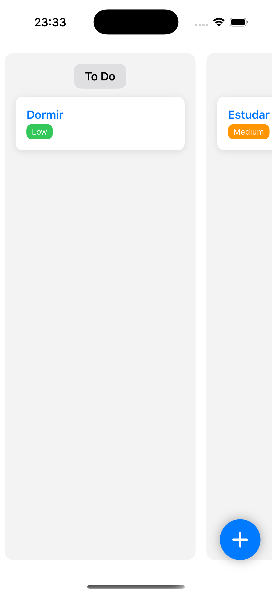

# TODO APP

This app was made to learn some basic concepts of Swift UI and Combine. I also used SwiftData for Data Persistence.

This app allow you to create a task with a title, subtitle and priority.

## Concepts

- **Swift UI:** Apple Framework to build interfaces. It uses declarative syntax, which means you describe what the UI should look like. 

- **Combine:** A Framework for managing asynchronous events and data streams in a clean and reactive way. It helps to handle inputs, network calls and data updates over time.

- **SwiftData:** It helps with data persistence. It lets us store, fetch and manage data easily (Swift native API). It's like CoreData but modern and Swift friendly.

- **MVVM (Model-View-ViewModel):** It helps to organize the code making each one responsable for one thing. It helps with maintance, test and scale.
    - **Model:** Represents the structure and logic of the app's information.
    - **View:** This is the UI. It is responsable to display the data and reacts to user information.
    - **ViewModel:** This connects the View with the Model. It holds the business logic, transforms data for the View and responds to user actions.

## Screenshots of this app

| Initial Page | New Task | Detail |
| ----------- | --------- | ------- |
|  |  | 

:warning: This app was made only to understand the basics of SwiftUI. Because of this, I didn't implemented the delete task or other functionalities that it would be cool. 

PS: I tried to implement drag and drop, but I failed 😢

I'll keep trying later.